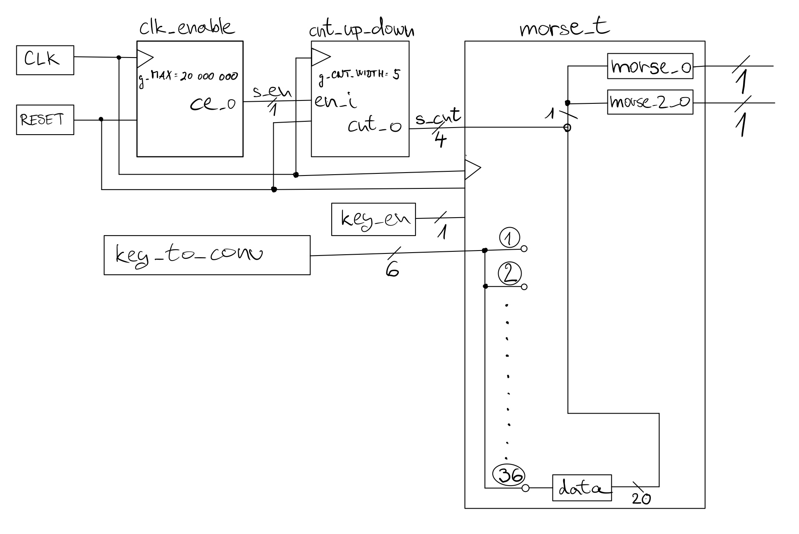

# MORSE TRANSMITTER

### Team members

* Jan Pavlacka (responsible for coffee)
* Filip Voch   (responsible for xxx)
* Josef Macek  (responsible for xxx)
* Daniel Smyd  (responsible for xxx)

### Table of contents

* [Project objectives](#objectives)
* [Hardware description](#hardware)
* [VHDL modules description and simulations](#modules)
* [TOP module description and simulations](#top)
* [Video](#video)
* [References](#references)

## Project objectives

Implementace kódu na desku Nexys-A7-50T schopného přeložit čísla a písmena do morseovy abecedy

## Hardware description

Používáme desku Nexys-A7-50T a využíváme tyto její komponenty:
Clock100MHz
7 přepínačů SW
modrou a červenou RGB LED
tlačítko BTNC

## VHDL modules description and simulations

clock_enable - zpomalení hodinového signálu
cnt_up_down - čítač, který pracuje v režimu čítání směrem dolů  
morse_t - přiřazení 20bit signálu data, který znázorňuje dané číslo nebo písmeno v morseově abecedě ke konkrétnímu číslu nebo písmenu a následné přiřazení tohoto signálu na výstupní 1bit proměnou morse_o

*převedení písmena W na morseovu abecedu zobrazenou v proměné morse_o

## TOP module description and simulations

Propojení všech signálů dle obrázku:

## Video

Write your text here

## References

1. https://digilent.com/reference/programmable-logic/nexys-a7/reference-manual
2. https://androidaplikace.cz/wp-content/uploads/Morseova-abeceda-e1333354673390.gif
3. https://github.com/tomas-fryza/digital-electronics-1
